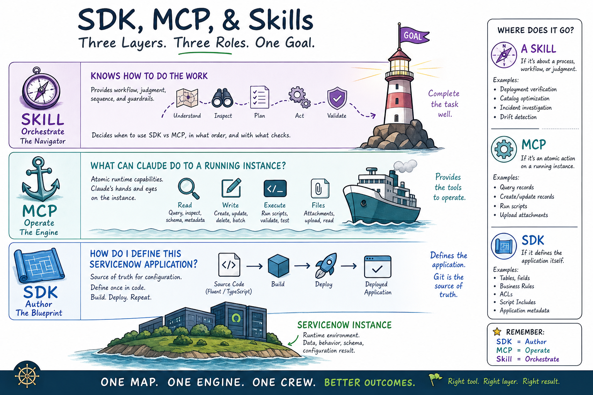

# foundry-suite — Claude's ServiceNow toolkit, built around Fluent (`now-sdk`)

A Claude Code **plugin marketplace** for working on ServiceNow the Fluent way. It
ships **plugins** you can install separately or together, and it grows over
time.

This suite does **not** install or replace [`now-sdk`](https://github.com/ServiceNow/sdk)
(the official **Fluent SDK**, published as [`@servicenow/sdk`](https://www.npmjs.com/package/@servicenow/sdk)
on npm) — get that from its own repo. Foundry-suite is the layer that sits
*next to* it: an MCP server for the running instance, plus skills that know
when to defer to `now-sdk` and when to act on their own.

| Plugin | What it is |
|---|---|
| **[`now-mcp`](plugins/now-mcp/README.md)** | A small, trustworthy, **Fluent-native** [MCP](https://modelcontextprotocol.io) server that lets Claude **operate a running ServiceNow instance** — read/write runtime data, inspect schema, run scripts, manage attachments. Carries the `sn-docs-search` skill and a SessionStart hook that injects the standing Fluent-workflow rules into a Fluent project's `CLAUDE.md`. |
| **[`aia-toolkit`](plugins/aia-toolkit/README.md)** | Skills for the full **ServiceNow AI Agent lifecycle** — build an agent as now-sdk Fluent, audit it against deployment guardrails, build eval datasets, set up the platform eval pipeline, and analyze runtime execution traces. Skills-only; pairs with `now-mcp` for live-instance reads. |

## The idea in one paragraph

* **No Wrapping, No Replacement:** We do **not** wrap, abstract, or replace `now-sdk` (Fluent). `now-sdk` remains the absolute, single source of truth for your application's definition, schema, and metadata.
* **Separation of Concerns:** 
  * **Fluent (`now-sdk`) defines the application** (the compile-time blueprint: tables, business rules, ACLs, workflows) as source code.
  * **`now-mcp` operates the running instance** (the runtime layer: querying records, reading live schema, writing data rows, executing server-side scripts, managing attachments).
  * **Skills orchestrate the two** into seamless developer and agent workflows.
* **The Boundary:** **Data rows are runtime (MCP); configuration/metadata is the app's definition (Fluent source).** This is why the MCP writes an incident, but *never* writes or modifies a business rule directly.
* **Ground truth over memory:** before writing any Fluent (`*.now.ts`), run
  [`now-sdk explain <topic>`](https://github.com/ServiceNow/sdk) — its built-in,
  always-current API reference — rather than trusting a remembered shape. This
  rule is auto-injected into a Fluent project's `CLAUDE.md` by `now-mcp`; see
  [`plugins/now-mcp/README.md`](plugins/now-mcp/README.md#fluent-workflow-rules-auto-injected).




---

## Install

The suite ships as Claude Code **plugins** from the `foundry-suite`
marketplace — install from git, no manual build. Add the marketplace once, then
install whichever plugins you want:

```
/plugin marketplace add <REPO_URL>
/plugin install now-mcp@foundry-suite      # the MCP server + Fluent skills/hook
/plugin install aia-toolkit@foundry-suite  # the AI Agent lifecycle skills (optional)
/reload-plugins
```

Install `now-mcp` alone for the data/schema/script tools; add `aia-toolkit` when
you work on ServiceNow AI Agents. `aia-toolkit` is skills-only (no setup form)
and uses `now-mcp` for its live-instance reads, so installing both is the usual
setup.

Neither plugin installs `now-sdk` itself — get the CLI separately from
[`github.com/ServiceNow/sdk`](https://github.com/ServiceNow/sdk)
(`pnpm add -g @servicenow/sdk`) if you'll be authoring Fluent alongside it.

For per-plugin setup, tools, configuration, and safety details, see each
plugin's README:

- **[`plugins/now-mcp/README.md`](plugins/now-mcp/README.md)** — connection setup
  (single-instance form or YAML), the full tool surface, now-sdk pairing, and the
  safety model.
- **[`plugins/aia-toolkit/README.md`](plugins/aia-toolkit/README.md)** — the five
  AI Agent skills, where to start, and the eval flow.

---

## Repository layout

```
foundry-suite/
├── .claude-plugin/marketplace.json   # the marketplace manifest
├── plugins/
│   ├── now-mcp/                       # the MCP server plugin (self-contained)
│   └── aia-toolkit/                   # the AI Agent skills plugin
├── docs/
├── LICENSE
└── README.md                         # you are here
```
