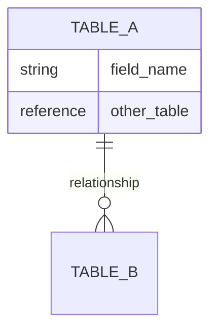
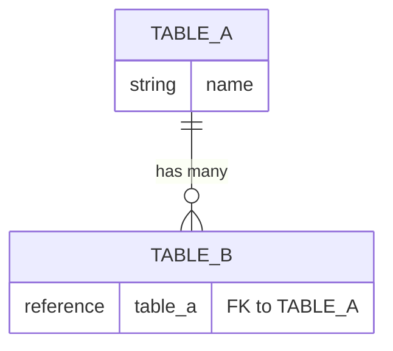
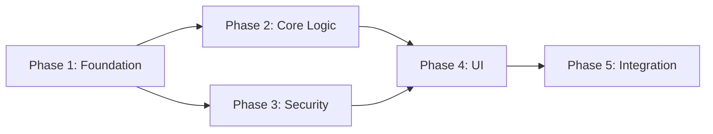

# Technical Specification Template

> Reference file for the architect-agent. This template defines the exact structure of the technical specification output. Follow it precisely for consistency across features.

---

## technical-spec.md

```markdown
# <Feature Name> — Technical Specification

## Overview

<2-3 sentence technical summary: what is being built, what existing systems it touches, and how it fits into the current architecture. Reference the product specification by path.>

**Product Specification:** `./specs/<FEATURE_ID>/brainstorm/specification.md`
**Architecture Diagrams:** `./specs/<FEATURE_ID>/architecture/diagrams.md`
**Application Scope:** `<scope_name from plugin.properties>`

## Existing Architecture

<Description of the current state of the system relevant to this feature. What already exists that this feature will touch, extend, or depend on.>

### Current Data Model

<Mermaid ER diagram showing existing tables and relationships that this feature interacts with.>



### Current Components

| Component | Type | Purpose |
|-----------|------|---------|
| <name> | <Script Include / Business Rule / ACL / Widget / etc.> | <what it does today> |

<List only components that this feature will touch or extend. Not a full inventory.>

## Data Model

### New Tables

#### <table_name> (Label: "<Table Label>")

**Extends:** `<parent table or "Base table">`

| Field | Type | Max Length | Mandatory | Default | Reference | Description |
|-------|------|-----------|-----------|---------|-----------|-------------|
| <field_name> | <String / Integer / Boolean / Reference / Choice / Date/Time / etc.> | <length> | <Yes/No> | <default value or —> | <referenced table or —> | <what this field stores> |

<Repeat #### block for each new table>

### Modified Tables

#### <existing_table_name>

| Change | Field | Details |
|--------|-------|---------|
| Add field | <field_name> | <type, length, mandatory, description> |
| Modify field | <field_name> | <what changes and why> |

<Repeat #### block for each modified table>

### Relationships



<Describe each relationship: cardinality, cascade behavior, and business meaning.>

### Indexes

| Table | Fields | Type | Reason |
|-------|--------|------|--------|
| <table_name> | <field1, field2> | <Unique / Non-unique> | <query pattern this supports> |

## Business Logic

### Script Includes

#### <ScriptIncludeName>

**Client callable:** <Yes/No>
**Purpose:** <what this service does>

| Method | Parameters | Returns | Description |
|--------|-----------|---------|-------------|
| <methodName> | `<param1>` (Type), `<param2>` (Type) | <return type> | <what it does> |

<Repeat #### block for each Script Include>

### Business Rules

#### <Business Rule Name>

| Attribute | Value |
|-----------|-------|
| Table | <table_name> |
| When | <before / after / async / display> |
| Insert | <Yes/No> |
| Update | <Yes/No> |
| Delete | <Yes/No> |
| Query | <Yes/No> |
| Condition | <condition expression or "None"> |

**Logic:** <Plain language description of what the rule does. NOT code.>

<Repeat #### block for each Business Rule>

### Scheduled Jobs

#### <Job Name>

| Attribute | Value |
|-----------|-------|
| Run | <schedule: e.g., "Daily at 02:00", "Every 15 minutes"> |
| Condition | <when it should run or skip> |

**Logic:** <What it does on each execution>

<Only include this section if the feature requires scheduled jobs>

## Security

### Roles

| Role | Contains | Description |
|------|----------|-------------|
| <role_name> | <contained roles, comma-separated, or "—"> | <who gets this role and what it grants> |

### ACLs

#### <table_name>

| Operation | Role Required | Condition | Field-Level |
|-----------|--------------|-----------|-------------|
| Read | <role_name> | <advanced condition or "None"> | — |
| Write | <role_name> | <condition> | — |
| Create | <role_name> | <condition> | — |
| Delete | <role_name> | <condition> | — |
| Report View | <role_name> | <condition> | — |

<Repeat #### block for each table that needs ACLs>

### Field-Level Security

| Table | Field | Read | Write | Condition |
|-------|-------|------|-------|-----------|
| <table_name> | <field_name> | <role> | <role> | <when this restriction applies> |

<Only include this section if field-level security is needed>

## User Interface

### Portal Pages

#### <Page Name>

**URL:** `/<portal_url_suffix>/<page_id>`
**Who sees it:** <persona/role>

| Widget | Position | Purpose |
|--------|----------|---------|
| <widget_name> | <top / body / bottom> | <what it shows or does> |

<Repeat #### block for each portal page>

### Widgets

#### <Widget Name>

**Type:** <Angular / AngularJS / Standard>

| Property | Type | Description |
|----------|------|-------------|
| <option_name> | <String / Reference / Boolean / etc.> | <what it controls> |

**Server Script:** <plain language description of server-side data logic>

**Client Script:** <plain language description of client-side behavior>

**Dependencies:** <other widgets, Script Includes, or services this widget calls>

<Repeat #### block for each widget>

### Forms & Lists

#### <Table Name> — Form

| Section | Fields | Visibility |
|---------|--------|------------|
| <section_name> | <field1, field2, field3> | <always / conditional on ...> |

#### <Table Name> — List

| Column | Order | Default Sort |
|--------|-------|-------------|
| <field_name> | <1, 2, 3...> | <ASC / DESC / —> |

<Only include this section if form/list customization is needed>

### Client Scripts

#### <Client Script Name>

| Attribute | Value |
|-----------|-------|
| Table | <table_name> |
| Type | <onChange / onLoad / onSubmit / onCellEdit> |
| Field | <field_name (for onChange) or "—"> |

**Logic:** <What it does from the user's perspective>

<Repeat #### block for each Client Script>

### UI Policies

#### <UI Policy Name>

| Attribute | Value |
|-----------|-------|
| Table | <table_name> |
| Condition | <when this policy activates> |

**Actions:**

| Field | Mandatory | Visible | Read Only |
|-------|-----------|---------|-----------|
| <field_name> | <True/False/—> | <True/False/—> | <True/False/—> |

<Repeat #### block for each UI Policy>

## Automation

### Flows

#### <Flow Name>

| Attribute | Value |
|-----------|-------|
| Trigger | <trigger type and condition — e.g., "Record updated on visitor table, condition: state changes to checked_in"> |
| Run As | <System / Current User> |

**Steps:**

1. <action — e.g., "Look up host record from visitor.host field">
2. <action — e.g., "Send notification to host">
3. <action — e.g., "Update visitor_log record">

**Calls:** <Script Includes, subflows, or "none">

<Repeat #### block for each Flow>

### Scheduled Jobs

#### <Job Name>

| Attribute | Value |
|-----------|-------|
| Run | <schedule: e.g., "Daily at 02:00", "Every 15 minutes"> |
| Condition | <when it should run or skip> |

**Logic:** <What it does on each execution>

### Events

| Event Name | Fired By | Parameters | Consumed By |
|------------|----------|------------|-------------|
| `<scope.event_name>` | <component that fires it — e.g., "BR: visitor_after_checkin"> | `parm1`: <value>, `parm2`: <value> | <notification rule, script action, or flow> |

<Only include Automation section if the feature requires flows, scheduled jobs, or events>

## Notifications

### Event Registrations

| Event | Table | Description |
|-------|-------|-------------|
| `<scope.event_name>` | `<table>` | <when this event fires> |

### Notification Rules

#### <Notification Name>

| Attribute | Value |
|-----------|-------|
| Event | `<event_name>` |
| Recipients | <who receives — e.g., "Host (from visitor.host field)", "Event: parm1 (user sys_id)"> |
| Channel | <Email / SMS / Push> |
| Condition | <additional conditions beyond the event, or "None"> |

**Subject:** `<email subject line — e.g., "Your visitor ${visitor.name} has arrived">`

**Body Summary:** <plain language description of email content — not the full template, just what information it contains>

### Email Templates

| Template | Used By | Key Fields |
|----------|---------|------------|
| `<template_name>` | <notification rule name> | <dynamic fields used — e.g., "visitor.name, host.name, visit.expected_arrival"> |

<Only include Notifications section if the product spec defines notifications. Map each notification from the product spec's "Notifications & Communications" section to the technical components here.>

## Configuration

### System Properties

| Property Name | Type | Default | Description | Used By |
|---------------|------|---------|-------------|---------|
| `<scope>.<property_name>` | <String / Integer / Boolean / Choice> | <default value> | <what this controls — e.g., "How many minutes before scheduled arrival a visitor can check in"> | <components that read this property> |

<Map each setting from the product spec's "Configuration & Settings" section to a system property. Include the full property name (scope-prefixed), type, default, and which components read it. Only include this section if the product spec defines configurable settings.>

## Integrations

### Inbound REST APIs

#### <API Name>

**Base path:** `/api/<scope>/<resource>`

| Method | Endpoint | Request Body | Response | Auth |
|--------|----------|-------------|----------|------|
| <GET/POST/PUT/DELETE> | `/<path>` | <JSON schema summary or "—"> | <JSON schema summary> | <role or "Public"> |

**Error Responses:**

| Status | Condition | Body |
|--------|-----------|------|
| 400 | <when> | <error message> |
| 403 | <when> | <error message> |
| 404 | <when> | <error message> |

<Repeat #### block for each API>

### Outbound Integrations

#### <Integration Name>

| Attribute | Value |
|-----------|-------|
| Target | <external system or URL> |
| Protocol | <REST / SOAP / Email / Event> |
| Trigger | <what causes this to fire> |
| Auth | <method: OAuth, Basic, API Key, etc.> |

**Payload:** <what data is sent>

**Error Handling:** <what happens on failure: retry, queue, alert, fallback>

<Only include Integrations section if the feature has API or integration requirements>

## E2E Testing

> Playwright test specifications for validating key user flows end-to-end. Tests are designed at the architecture phase so the planning agent can create implementation tasks for them and the test agent can generate the actual test code.
>
> **Framework:** `@playwright/test` v1.40.0+ with `wsd-ui-test` v1.0.3 and `@servicenow/commons-test-js-utils` v2.0.3.
>
> **Key principle:** Tests assert on **outcomes** (records created/modified via API verification, ACLs enforced, correct UI state) rather than exact text content, because LLM-driven interfaces and dynamic content produce non-deterministic responses.

### Test File Structure

```
tests/
├── helpers/
│   ├── fixtures.js              # Custom fixtures extending @playwright/test
│   ├── <entity>-factory.js      # Test data creation and cleanup via REST API
│   └── <feature>-helpers.js     # Reusable interaction utilities for the feature
├── <area>/
│   └── <scenario>.spec.js       # Test file per user flow area
```

### Test Helpers

<Describe the reusable helper modules needed for this feature's tests. Each helper should have a table of functions.>

#### <helper-name>.js

| Function | Purpose |
|----------|---------|
| `<functionName>(params)` | <what it does — e.g., "Opens the Now Assist panel and waits for it to be visible"> |

#### <entity>-factory.js

| Function | Purpose |
|----------|---------|
| `createTest<Entity>(tracker, opts, apiOpts)` | <Creates a test record via REST API. Adds to tracker for cleanup.> |
| `verify<Entity>Created(apiOpts, filters)` | <Queries table and returns matching records. Used to verify the feature created a record correctly.> |
| `cleanupAll(tracker, apiOpts)` | Deletes all tracked records in reverse dependency order. |

#### fixtures.js

| Fixture | Purpose |
|---------|---------|
| `<roleName>Page` | Pre-authenticated page as a user with `<role>`. Uses `storageState`. |
| `tracker` | Cleanup tracker — automatically calls `cleanupAll` in `afterAll`. |
| `apiOpts` | REST API options (instance URL, auth headers) for record verification. |

### Test Specifications

<For each test file, list the individual tests with steps and assertions. Tag each test with a priority: `@high` (core happy paths, security boundaries), `@medium` (alternate flows, edge cases), `@low` (cosmetic, nice-to-have).>

#### <area>/<scenario>.spec.js — <N> tests

| Test | Steps | Assertions |
|------|-------|------------|
| `@high` <test name> | <user-facing steps — navigate, interact, provide input> | <what to verify — API checks, UI state, response content patterns> |
| `@medium` <test name> | <steps> | <assertions> |

<Repeat #### block for each test file.>

### Manual Tests

<List any scenarios that cannot be automated with Playwright and explain why.>

| Test | Why Manual | Complexity |
|------|-----------|------------|
| <test name> | <reason — e.g., "Requires mobile device", "Crosses application boundary"> | <Low / Medium / High> |

### E2E Test Design Guidelines

When designing E2E tests for this feature:

- **Assert on outcomes, not content** — verify records via API, check for URL patterns in links, validate ACL boundaries. Do not assert on exact text from LLM-driven responses or dynamic content.
- **One test file per user flow area** — group related scenarios (e.g., all intake tests, all retrieval tests) into a single spec file.
- **Pre-create test data via factories** — every test creates its own data via REST API and cleans up after. Tests must not depend on pre-existing data.
- **Use pre-authenticated sessions** — define fixtures with `storageState` for each role persona needed. No manual login handling in tests.
- **Set appropriate timeouts** — interactions with AI agents, async workflows, or heavy pages need longer timeouts (30s+) vs standard form interactions (5s default).
- **Centralise selectors** — put all page-specific selectors in helper modules so they're updated in one place when the UI changes between platform versions.
- **Tag by priority** — `@high` for core paths and security tests that must pass before release, `@medium` for alternate flows, `@low` for cosmetic checks.
- **Cover ACL boundaries explicitly** — for any feature with role-based access, include paired tests: one proving access works for the permitted role, one proving it is denied for the unpermitted role.

<Include this section for every feature. Even simple features benefit from at least 2-3 E2E tests covering the happy path and a key error/boundary case.>

## Demo Data

### Required Records

| Table | Record Description | Key Field Values | Purpose |
|-------|-------------------|------------------|---------|
| `<table_name>` | <what this record represents — e.g., "VIP visitor with upcoming visit"> | `name`: "Jane Smith", `visitor_type`: "VIP", `state`: "invited" | <why it's needed — e.g., "Test VIP check-in flow"> |
| `<table_name>` | <description> | <key fields> | <purpose> |

### Data Relationships

<Describe how demo records relate to each other — e.g., "3 visitors linked to 1 visit, with 1 host and 1 location. One visitor is checked in, one is invited, one is cancelled — covering all states.">

### Roles & Users

| User | Role | Purpose |
|------|------|---------|
| <demo user — e.g., "demo.host"> | `<role>` | <what this user tests — e.g., "Host experience: receiving visitors, approving visits"> |
| <demo user — e.g., "demo.frontdesk"> | `<role>` | <what this user tests> |

<Demo data must cover: all states/lifecycle stages, all roles, key edge cases (empty states, boundary conditions). Records go in `unload.demo/`.>

## Traceability

> Maps each acceptance criterion from the product specification to the technical components that implement it. This table is used by the planning agent to create testable tasks and by the test agent to know what to verify.

| User Story | Acceptance Criterion | Implementing Components | Layer |
|------------|---------------------|------------------------|-------|
| <story title from product spec> | <specific AC — e.g., "Resolution code is mandatory when state=Closed"> | `<UI Policy: require_resolution_on_close>`, `<Client Script: validate_resolution_onSubmit>` | UI, Business Logic |
| <story title> | <AC> | `<component list>` | <layers> |

<Every acceptance criterion from the product spec must appear in this table. If an AC maps to no component, flag it as a gap in Open Questions.>

## Architecture Decisions

### ADR-001: <Decision Title>

**Status:** Proposed | Accepted | Deprecated

**Context:** <What is the technical question or challenge?>

**Decision:** <What approach was chosen?>

**Alternatives Considered:**

| Alternative | Pros | Cons |
|-------------|------|------|
| <Option A> | <benefits> | <drawbacks> |
| <Option B> | <benefits> | <drawbacks> |

**Consequences:**

- **Positive:** <benefits of this decision>
- **Negative:** <drawbacks or trade-offs accepted>
- **Risks:** <potential issues and how to mitigate them>

<Repeat ### ADR block for each significant decision. Number sequentially: ADR-001, ADR-002, etc.>

## Implementation Plan

### Phase 1: <Phase Name> (e.g., "Foundation")

**What:** <what gets built in this phase>
**Depends on:** <previous phases or "Nothing — can start immediately">
**Delivers:** <what's usable after this phase>

| Component | Type | Complexity |
|-----------|------|------------|
| <name> | <table / script include / ACL / widget / etc.> | <Low / Medium / High> |

### Phase 2: <Phase Name>

<Same structure as Phase 1>

<Repeat ### Phase block for each implementation phase>

### Dependency Graph



### Parallel Work Opportunities

| Track A | Track B | Notes |
|---------|---------|-------|
| <work item> | <work item> | <what can be done simultaneously> |

### Risk Areas

| Risk | Impact | Mitigation |
|------|--------|------------|
| <what could go wrong> | <consequence> | <how to reduce risk> |

## Testing Strategy

> Defines the complete testing approach: what exists today, what's impacted by this feature, and what new tests are needed. This section is designed at architecture time — not as an afterthought during implementation. It is used by the planning agent to create test-specific implementation steps and by the test agents to generate tests without guessing scope.

### Existing Test Inventory

> Tests that already exist and cover the areas this feature touches. Read the actual test projects to populate this — do not guess.

#### Unit Tests

| Test File | Script Include | Methods Covered | Status |
|-----------|---------------|-----------------|--------|
| `<path to *_spec.js>` | `<ScriptIncludeName>` | `<method1>`, `<method2>` | <Passing / Failing / Unknown> |

#### Integration Tests

| Test Class | What It Tests | Tables/Components Covered | Status |
|------------|--------------|---------------------------|--------|
| `<NameIT.java>` | <ACL / BR / Job / Notification> | `<table_name>`, `<component_name>` | <Passing / Failing / Unknown> |

#### E2E Tests

| Test File | What It Tests | Pages/Flows Covered | Status |
|-----------|--------------|---------------------|--------|
| `<name.spec.js>` | <user flow description> | `<URL or page name>` | <Passing / Failing / Unknown> |

<If no existing tests cover the affected area, state "No existing test coverage for the components this feature touches." This is valuable information — it means all tests are net-new.>

### Test Impact Assessment

> For every component being **modified** (not created), assess the impact on existing tests.

| Existing Test | Component Changed | Impact | Action |
|---------------|-------------------|--------|--------|
| `<test file or class>` | `<component being modified>` | <Breaks — behavior changed / Needs update — new states or fields / Obsolete — component removed> | <Update: describe what changes / Remove: explain why / Rewrite: explain scope> |

<If no existing tests are impacted, state "No existing tests are impacted by this feature." Only include tests that are genuinely affected by the changes designed in this spec.>

### New Unit Tests

> One entry per Script Include method that is new or modified. The test agent uses this to generate `*_spec.js` files.

#### <ScriptIncludeName>

| Method | Test Scenario | Input | Expected Output | Edge Cases |
|--------|--------------|-------|-----------------|------------|
| `<methodName>` | <happy path description> | `<param1>`: value, `<param2>`: value | <expected return value or side effect> | — |
| `<methodName>` | <error case description> | `<param1>`: invalid value | <expected error behavior> | — |
| `<methodName>` | <edge case description> | `<param1>`: boundary value | <expected behavior> | <what makes this an edge case> |

<Repeat #### block for each Script Include with new or modified methods. Do not include Script Includes that are unchanged.>

### New Integration Tests

> Server-side behavior that must be validated against a real Glide instance. Categorized by test type.

#### ACL Tests

| Table | Operation | Role | Expected Access | Condition |
|-------|-----------|------|-----------------|-----------|
| `<table_name>` | <Read / Write / Create / Delete> | `<role_name>` | <Granted / Denied> | <record-level or field-level condition, or "Table-level"> |

<One row per table × operation × role combination. Include both positive (access granted) and negative (access denied) cases. Cover all new roles and all new tables.>

#### Business Rule Tests

| Business Rule | Trigger | Setup State | Expected Side Effect | Assertion |
|---------------|---------|-------------|---------------------|-----------|
| `<BR name>` | <field change or insert that triggers it> | <precondition — e.g., "record in state=planned"> | <what should happen — e.g., "active set to false, related records updated"> | <how to verify — e.g., "Query target table, assert field values"> |

#### Scheduled Job Tests

| Job | Setup | Expected Outcome | Assertion |
|-----|-------|-----------------|-----------|
| `<job name>` | <precondition records and state> | <what changes after execution> | <how to verify> |

<Only include if the feature has scheduled jobs.>

#### Notification Tests

| Event | Trigger | Expected Recipient | Expected Subject Fragment |
|-------|---------|-------------------|--------------------------|
| `<event_name>` | <what action fires it> | <who should receive> | <key text in subject line> |

<Only include if the feature has notifications.>

### New E2E Tests

> User-facing flows that must be validated via browser automation. One entry per distinct user flow.

| Flow | Persona | UI Surface | Steps | Key Assertions |
|------|---------|-----------|-------|----------------|
| `<flow name — e.g., "Create visit as host">` | `<persona — e.g., "host">` | <Portal / Standard UI / Workspace / ESC> | <numbered steps: 1. Navigate to X, 2. Fill field Y, 3. Click Z> | <what to assert — e.g., "Success message visible, record created with correct state, redirect to list view"> |

<Include happy path flows, key error flows (e.g., validation failures), and role-based access flows (e.g., "user without role sees access denied"). Map each flow to the product spec user stories it validates.>

### Test Data Requirements

> Records, users, and roles needed specifically for automated tests. This is separate from Demo Data (which is for human onboarding in `unload.demo/`).

#### Test Users

| Username | Roles | Purpose |
|----------|-------|---------|
| `<test.username>` | `<role1>`, `<role2>` | <what this user tests — e.g., "ACL tests: verify staff-level access to visitor records"> |

#### Test Records

| Table | Description | Key Fields | Used By |
|-------|-------------|------------|---------|
| `<table_name>` | <what this record represents> | `<field>`: value, `<field>`: value | <which test types use it — e.g., "ACL tests, BR tests"> |

#### Test Data Relationships

<Describe how test records relate to each other and what lifecycle states they cover. Test data should be designed for idempotent loading — using INSERT_OR_UPDATE with stable sys_ids for integration tests, and API-created ephemeral records for e2e tests.>

## Open Questions

| # | Question | Context | Impact | Status |
|---|----------|---------|--------|--------|
| 1 | <unresolved question> | <why it matters technically> | <what it blocks or affects> | Open |

<Only include genuine open questions that couldn't be resolved during the design session. Do NOT include questions you can answer from the product spec or codebase analysis.>
```

---

## Writing Guidelines

When filling in this template:

- **Write for two audiences**: the planning agent (who creates work items) and the implementation agent (who writes code)
- **Be precise about ServiceNow types**: use exact field types (`String`, `Reference`, `Choice`, `True/False`, `Journal`, `Date/Time`), not generic descriptions
- **Every component must be buildable**: if an engineer can't implement it from your description alone, add more detail
- **Business Rules describe logic, not code**: "Set the approval field to 'requested' when the visitor type is 'VIP' and the host has auto-approve disabled" — not pseudocode
- **ACLs must be complete**: 5 operations per table, no exceptions. If a table doesn't need delete access, the ACL should deny it explicitly
- **Mermaid diagrams are required** for: data model relationships, implementation phase dependencies, and any complex flow that benefits from visualization
- **Architecture diagrams file** (`diagrams.md`): after drafting the tech spec, offer to generate a separate diagrams file with component diagrams, sequence diagrams per user flow, decision flowcharts for branching logic, and tool/capability distribution charts. Every diagram needs a title, description, and legend where colour coding is used
- **Implementation phases must be incremental**: each phase should deliver something testable, not just "set up infrastructure"
- **ADRs capture the conversation**: document what was discussed with the user, what alternatives they considered, and why they chose what they chose
- **Notifications must trace to the product spec**: every notification in the product spec's "Notifications & Communications" section must have corresponding event registration, notification rule, and email template
- **Configuration must trace to the product spec**: every setting in the product spec's "Configuration & Settings" section must have a system property with scope-prefixed name
- **Traceability must be complete**: every acceptance criterion from the product spec must map to at least one implementing component. If it doesn't, flag it as an open question
- **E2E tests must cover all user-facing flows**: every user journey in the product spec should have at least one `@high` priority Playwright test. Include test helpers (factories, fixtures, interaction utilities) so the test agent can generate the actual test code. Assert on outcomes (API-verified records, ACL boundaries) not exact UI text
- **Demo data must cover all states**: include records in every lifecycle state so testers can verify the full range of behavior without creating data manually
- **Testing strategy must be based on actual exploration**: read the existing test projects before writing the Testing Strategy section. Never guess what tests exist — inventory them from the filesystem. If no test projects exist, state that explicitly.
- **Test impact assessment must cover every modified component**: if the tech spec modifies a Script Include method, Business Rule, ACL, or UI component, check whether existing tests cover it and document the impact. A missing impact assessment for a modified component is a gap.
- **Separate test data from demo data**: test data is for automated test execution (loaded by DataLoader, created by API factories, cleaned up after runs). Demo data is for human onboarding and exploration (loaded into `unload.demo/`). They serve different purposes and may have different records.
- **Unit tests must specify edge cases**: for each Script Include method, document not just the happy path but also error conditions, boundary values, and null/empty inputs. The test agent uses these to generate comprehensive `*_spec.js` files.
- **ACL tests must cover both positive and negative cases**: for each role, specify both what it CAN access and what it CANNOT. A test that only verifies granted access misses the most dangerous bugs (overly permissive ACLs).
- **E2E tests must map to product spec user stories**: every user flow in the E2E test section should trace back to a specific user story or acceptance criterion from the product spec
