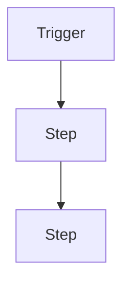
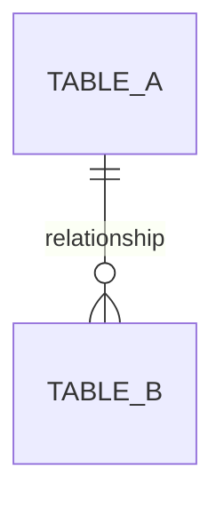
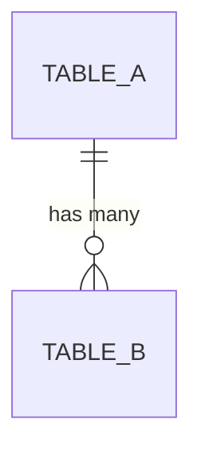
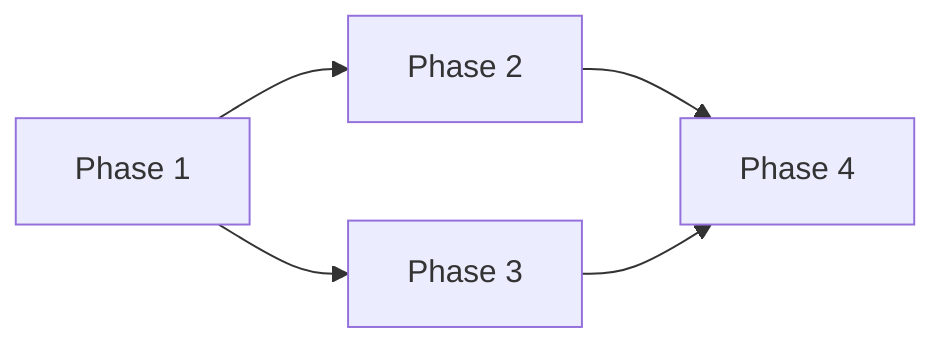

# Specification Templates

> Reference file for the spec-agent. `poc-spec.md` and `technical-spec.md` are not saved as separate files — they define the exact content structure that lives inside `index.html`'s `#structured-data` JSON (Phase A populates the PoC spec structure, Phase B the technical spec structure) and what the Export Markdown button must reproduce. Follow both templates precisely.

---

## poc-spec.md (Phase A — PoC Spec)

```markdown
# <PoC Name>

**Discovery Output:** `./intake-docs/discovery/index.html`
**Status:** draft | approved

## Overview

<2-3 sentence elevator pitch: what this PoC does and why it matters. Written so any customer stakeholder would understand it — no technical terms.>

## Problem Statement

<What pain, friction, or gap exists today. Be specific: who is affected, how often, what's the consequence of not solving it.>

## How It Works Today

<The current experience relevant to this PoC. What do people do now? What tools or workarounds do they use? If this is entirely new capability with no existing workflow, state that clearly.>

## Users & Personas

### <Persona Name>

| Attribute | Description |
|-----------|-------------|
| Who they are | <brief description of their role and context> |
| What they care about | <their priorities, goals, and frustrations> |
| How they interact | <where and how they use the system: mobile, desktop, kiosk, etc.> |

<Repeat for each persona>

## Scope

### In Scope

- <capability that IS included>

### Out of Scope

- <capability that is explicitly NOT included> — <brief reason>

## User Stories

### <Story Title>

**As a** <persona>, **I want** <capability>, **so that** <benefit>.

**Acceptance Criteria:**

- [ ] <specific, testable condition>
- [ ] <specific, testable condition>

<Repeat for each story>

## User Flows

### <Flow Name>

**Actor:** <persona>
**Trigger:** <what starts this flow>

1. <what the user sees or does>
2. <what happens next>
3. <continue step by step>



<Repeat for each major flow>

## Screen Descriptions

### <Screen Name>

**Who sees it:** <persona>
**When:** <what triggers this screen>

**What's on the screen:**
- <element>

**What the user can do:**
- <action> → <what happens>

<Repeat for each key screen>

## Notifications & Communications

| Event | Who Gets Notified | Channel | Content Summary |
|-------|-------------------|---------|-----------------|
| <trigger> | <persona> | <email / in-app / push> | <what the message says> |

<If no notifications: "No notifications required." with reason.>

## Configuration & Settings

| Setting | Who Controls It | Options | Default |
|---------|----------------|---------|---------|
| <what can be configured> | <admin / system> | <allowed values> | <default> |

<If no settings: "No configurable settings." with reason.>

## Edge Cases & Error States

| Scenario | What Happens |
|----------|-------------|
| <unusual situation> | <how the system responds from the user's perspective> |

## Success Metrics

| Metric | Target |
|--------|--------|
| <what to measure> | <expected outcome> |

## Open Questions

| Question | Context | Impact |
|----------|---------|--------|
| <unresolved question> | <why it matters> | <what it blocks> |
```

---

## technical-spec.md (Phase B — Tech Spec)

```markdown
# <PoC Name> — Technical Specification

**Spec Output:** `./intake-docs/spec/index.html`
**Application Scope:** `<scope_name>`

## Overview

<Technical summary: what is being built, what existing systems it touches, and how it fits into the current architecture.>

## Existing Architecture

<Current state of the system this PoC will touch or extend.>

### Current Data Model



### Current Components

| Component | Type | Purpose |
|-----------|------|---------|
| <name> | <Script Include / Business Rule / etc.> | <what it does today> |

## Data Model

### New Tables

#### <table_name> (Label: "<Label>")

**Extends:** <parent table or "Base table">

| Field | Type | Max Length | Mandatory | Default | Reference | Description |
|-------|------|-----------|-----------|---------|-----------|-------------|
| <name> | <String / Reference / Boolean / etc.> | <length> | <Yes/No> | <default or —> | <table or —> | <what it stores> |

### Modified Tables

#### <existing_table_name>

| Change | Field | Details |
|--------|-------|---------|
| Add field | <name> | <type, length, mandatory, description> |

### Relationships



### Indexes

| Table | Fields | Type | Reason |
|-------|--------|------|--------|
| <table> | <fields> | <Unique / Non-unique> | <query pattern> |

## Business Logic

### Script Includes

#### <ScriptIncludeName>

**Client callable:** <Yes/No>
**Purpose:** <what this service does>

| Method | Parameters | Returns | Description |
|--------|-----------|---------|-------------|
| <name> | `<param>` (Type) | <return type> | <what it does> |

### Business Rules

#### <Business Rule Name>

| Attribute | Value |
|-----------|-------|
| Table | <table_name> |
| When | <before / after / async / display> |
| Insert | <Yes/No> |
| Update | <Yes/No> |
| Delete | <Yes/No> |
| Condition | <condition or "None"> |

**Logic:** <Plain language — what the rule does. Not code.>

## Security

### Roles

| Role | Contains | Description |
|------|----------|-------------|
| <role_name> | <contained roles or "—"> | <who gets this and what it grants> |

### ACLs

#### <table_name>

| Operation | Role Required | Condition |
|-----------|--------------|-----------|
| Read | <role> | <condition or "None"> |
| Write | <role> | <condition or "None"> |
| Create | <role> | <condition or "None"> |
| Delete | <role> | <condition or "None"> |
| Report View | <role> | <condition or "None"> |

### Field-Level Security

| Table | Field | Read | Write | Condition |
|-------|-------|------|-------|-----------|
| <table> | <field> | <role> | <role> | <when> |

<Only include if field-level security is needed.>

## User Interface

### Portal Pages

#### <Page Name>

**URL:** `/<portal>/<page>`
**Who sees it:** <persona/role>

| Widget | Position | Purpose |
|--------|----------|---------|
| <name> | <top/body/bottom> | <what it does> |

### Widgets

#### <Widget Name>

**Server Script:** <plain language description of data logic>
**Client Script:** <plain language description of client behavior>
**Dependencies:** <other widgets, Script Includes this calls>

### Client Scripts

#### <Client Script Name>

| Attribute | Value |
|-----------|-------|
| Table | <table> |
| Type | <onChange / onLoad / onSubmit> |
| Field | <field or "—"> |

**Logic:** <What it does from the user's perspective>

## Automation

### Flows

#### <Flow Name>

| Attribute | Value |
|-----------|-------|
| Trigger | <trigger type and condition> |
| Run As | <System / Current User> |

**Steps:**
1. <action>
2. <action>

### Events

| Event Name | Fired By | Parameters | Consumed By |
|------------|----------|------------|-------------|
| `<scope.event_name>` | <component> | `parm1`: <value> | <consumer> |

<Only include Automation section if the PoC requires it.>

## Notifications

### Event Registrations

| Event | Table | Description |
|-------|-------|-------------|
| `<scope.event_name>` | `<table>` | <when it fires> |

### Notification Rules

#### <Notification Name>

| Attribute | Value |
|-----------|-------|
| Event | `<event_name>` |
| Recipients | <who receives it> |
| Channel | <Email / Push> |
| Condition | <additional condition or "None"> |

**Subject:** `<subject line>`
**Body Summary:** <what information it contains>

<Only include Notifications section if the PoC spec defines notifications.>

## Configuration

### System Properties

| Property Name | Type | Default | Description | Used By |
|---------------|------|---------|-------------|---------|
| `<scope>.<name>` | <String / Boolean / Integer> | <default> | <what it controls> | <components that read it> |

<Only include if the PoC spec defines configurable settings.>

## Integrations

### Inbound REST APIs

#### <API Name>

**Base path:** `/api/<scope>/<resource>`

| Method | Endpoint | Response | Auth |
|--------|----------|----------|------|
| <GET/POST/PUT/DELETE> | `/<path>` | <schema summary> | <role or "Public"> |

<Only include if the PoC has API requirements.>

## Verification Checklist

> Step-by-step manual checks to verify the PoC is working. For each item, what to do, what to observe, what a passing result looks like.

### Happy Path Verification

| Flow | Steps | Pass Condition |
|------|-------|---------------|
| <flow name from PoC spec> | <numbered steps: 1. Navigate to X, 2. Do Y> | <what success looks like> |

### ACL Spot-Checks

| Table | Operation | Role | Expected Result |
|-------|-----------|------|-----------------|
| <table> | <Read / Create / Delete> | <role> | <Granted / Denied> |

### Edge Case Checks

| Scenario | Steps | Expected Behavior |
|----------|-------|------------------|
| <from PoC spec edge cases> | <how to trigger it> | <what should happen> |

### Demo Data

| Table | Description | Key Values | Purpose |
|-------|-------------|------------|---------|
| <table> | <what the record represents> | `field`: value | <what it enables in the demo> |

## Traceability

| User Story | Acceptance Criterion | Implementing Components | Layer |
|------------|---------------------|------------------------|-------|
| <story title> | <specific AC> | `<component list>` | <Data / Logic / Security / UI> |

<Every AC from the PoC spec must appear here. Flag any unmapped ACs as open questions.>

## Architecture Decisions

### ADR-001: <Decision Title>

**Status:** Accepted

**Context:** <What is the technical question?>

**Decision:** <What was chosen?>

**Alternatives Considered:**

| Alternative | Pros | Cons |
|-------------|------|------|
| <Option A> | <benefits> | <drawbacks> |

**Consequences:** <trade-offs accepted>

<Repeat for each significant decision.>

## Implementation Plan

### Phase 1: <Name>

**Depends on:** <previous phases or "Nothing — can start immediately">
**Delivers:** <what's usable after this phase>

| Component | Type | Complexity |
|-----------|------|------------|
| <name> | <table / script include / ACL / widget / etc.> | <Low / Medium / High> |

<Repeat for each phase.>



## Open Questions

| # | Question | Context | Impact | Status |
|---|----------|---------|--------|--------|
| 1 | <question> | <why it matters> | <what it blocks> | Open |
```

---

## index.html

`index.html` is the **only output artifact** for the spec phase — there are no separate `poc-spec.md`, `technical-spec.md`, or `diagrams.md` files. It is the source of truth: the planning-agent reads from it; users edit it inline in the browser; the Export Markdown button derives both `.md` files (and `diagrams.md` if extra diagrams exist) on demand.

### How to generate

1. Copy `./plugins/sn-poc/skills/spec/index-template.html` verbatim
2. Fill every `{{PLACEHOLDER}}` with real content (placeholders and their expected content are documented in the template's comment block)
3. Populate the `#structured-data` JSON block:
   - **Phase A** (PoC spec): populate `pocSpec` only. Leave `techSpec` and `diagrams` as empty defaults.
   - **Phase B** (technical spec, after PoC spec approval): read the existing `index.html` back, merge `techSpec` and `diagrams` into the same JSON object, and rewrite the file — do not create a second file.
4. Save to `./intake-docs/spec/index.html`

See `index-template.html` for the full component reference (story cards, screen cards, ADR blocks, ACL blocks, mermaid diagram editors, editable tables and lists) and [spec-agent.md](../../agents/spec-agent.md) for the authoritative field-by-field JSON schema. The navigation sidebar (grouped PoC / Technical, with Technical collapsed by default per the two-audience requirement below), inline editing, Export Markdown, Save HTML, and Reset are all built into the template — do not reimplement them.

### Two-audience behavior

Technical Specification sections are collapsed by default (`.tech-collapsible`, toggled via the "Show Technical Spec" sidebar button) so the page defaults to a customer-safe view of just the PoC Specification. Mermaid diagrams (existing architecture, relationships, user flows, implementation plan phases, and any extra diagrams from Phase B8) render client-side via the Mermaid CDN — the one documented exception to "no external dependencies."

---

## Writing Guidelines

### PoC spec (poc-spec.md)
- **Non-technical language only** — no databases, tables, APIs, scripts, or fields
- **Describe user experience**, not system behavior
- **Every AC must be testable** — if you can't write a yes/no test for it, rewrite it
- **Be specific** — "Show: 'This meeting has already ended.'" not "Show an error message"

### Technical spec (technical-spec.md)
- **Written for two audiences**: the planning agent (who creates stories) and the implementation team (who builds)
- **Exact names throughout** — component names, method signatures, field names, property names verbatim
- **Business Rules describe logic, not code** — plain language, not pseudocode
- **ACLs must be complete** — 5 operations per new table, no exceptions
- **Traceability must be complete** — every AC maps to at least one component; gaps become open questions
- **Verification checklist is practical** — manual steps a developer or demonstrator can actually walk through
